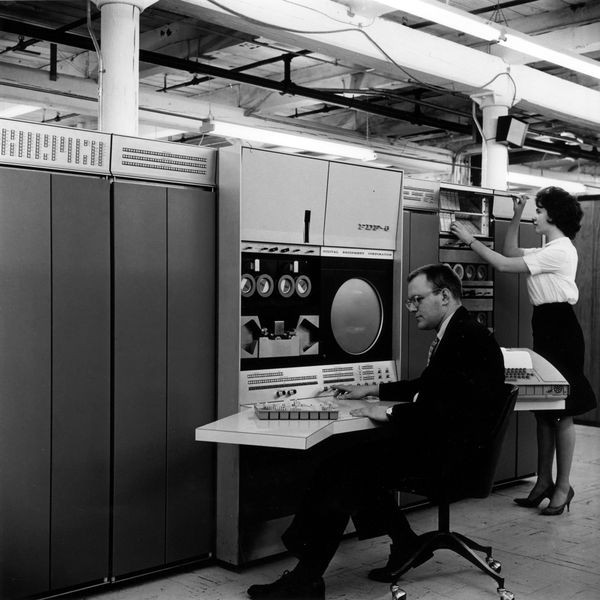
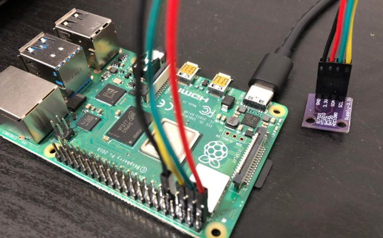
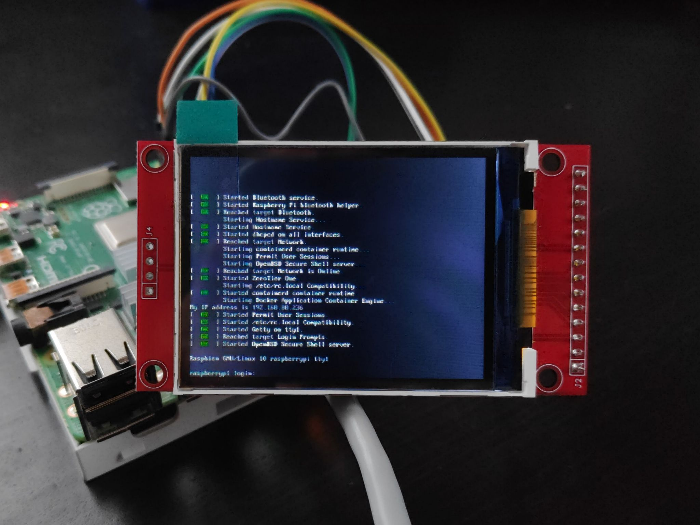
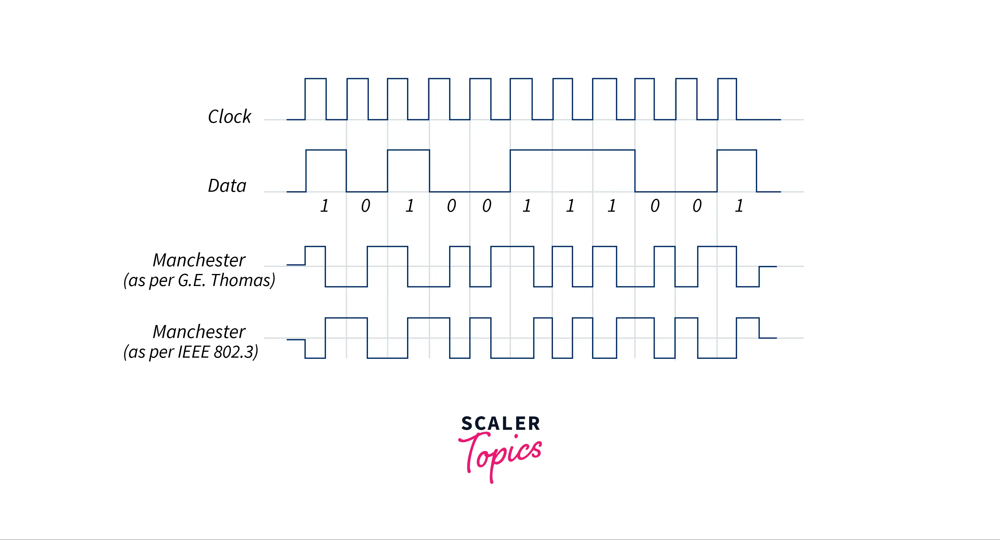

# Databussar och anslutningar

<!--
Chapter 5: Encoding & Timing
Signals by themselves are meaningless. Timing and encoding make data recoverable.
We’ll walk through UART, I²C, SPI, Manchester, and CAN.
-->

---

# UART – Asynchronous Serial

## No clock line

- High = 1, Low = 0
- Start bit → data bits → stop bit
- Timing depends on baud rate

<!--
UART is the simplest: just voltage levels over time.
Receiver trusts the sender’s timing.
Long runs risk drift if clocks differ.
Invented by Gordon Bell who died in 2024
-->

---

# The Clock Problem

## I²C (Inter-Integrated Circuit)

- Two wires: SDA (data), SCL (clock)
- Clock explicitly shared
- Multiple devices on one bus

<!--
I²C solves sync by including a clock line.
Everyone listens on the same timing beat.
-->

---

# Faster Clocked Transfers

## SPI (Serial Peripheral Interface)

- Clock + two data lines (MISO/MOSI)
- Very high speeds possible
- But requires more pins

<!--
SPI trades pins for performance.
A common choice for sensors needing speed.
-->

---

# Encoding With Transitions

## Manchester (Ethernet, RFID)

- Transition in middle of each bit
- Clock embedded in the signal
- Robust, fewer wires

<!--
Manchester encoding solves timing without a separate clock line.
Used in classic Ethernet, RFID tags.
-->

---

# Arbitration & Sync

## CAN Bus (Controller Area Network)

- Differential signaling
- Multi-master arbitration
- Encoded edges ensure sync

<!--
CAN is designed for noisy environments.
Differential signaling and arbitration make it reliable in cars and industry.
-->

---

# SDIO

## Not only for SD Cards

- 4-bit data bus + clock
- Used in WiFi, Bluetooth modules
- High speed, low pin count
- Bandwidth from 25 to 200 MB/s

<!--
CAN is designed for noisy environments.
Differential signaling and arbitration make it reliable in cars and industry.
-->

---

# M2 Connector

## Combines several busses

- Carries PCIe (NVMe), SATA, USB 2/3, I2C, SDIO, UART, GPIO
- Pin count varies by size (2230, 2242, 2260, 2280)
- Enables SSDs, WiFi, BT, WWAN, GNSS modules on same physical form factor
