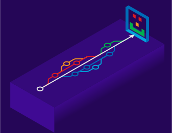

# Git

<https://git-scm.com>
<https://ndpsoftware.com/git-cheatsheet.html>
<https://learngitbranching.js.org>

---

## Git Branching strategy

En strukturerad arbetsprocess delar upp utvecklingen i olika branches, såsom *main*, *develop*, *feature*, och *release*. *Feature branches* används för att utveckla nya funktioner utan att påverka den stabila koden på *main*, medan *release* branches hanterar färdigställande och buggrättning inför lansering.

<https://www.gitkraken.com/learn/git/best-practices/git-branch-strategy>

---

## Conventional Commits

En standard för att skriva tydliga commit-meddelanden, vilket underlättar spårning och förståelse av ändringar. Detta inkluderar prefix som *feat*, *fix*, och *docs* för att indikera vilken typ av ändring som har gjorts. Denna tydlighet bidrar till bättre versionshantering och underlättar automatiserade releaser.

<https://conventionalcommits.org>

---

## Taggar och Semantic Versioning

Git taggar används för att markera viktiga milstolpar, såsom versioner eller specifika releaser, för att snabbt kunna identifiera stabila punkter i utvecklingen. Kan användas för att trigga CD.

<https://semver.org>
<https://www.gitkraken.com/gitkon/semantic-versioning-git-tags>

---

## Continuous Integration (CI)

Automatiserad byggnation och testning av kod varje gång en ändring görs, vilket säkerställer att nya ändringar inte bryter befintlig funktionalitet. Körs ofta vid push.

<https://github.com/features/actions>

---

## Kodgranskning

Pull/Merge requests som granskas och godkänns innan sammanslagning till huvudbranch. Kodgranskning ska inte användas för att plåga utvecklare, utan istället för att säkerställa att teammedlemmar följer med i utvecklingen av olika delar av projektet och för att sprida kunskap inom teamet. Detta skapar en gemensam förståelse för kodbasen, uppmuntrar diskussion och hjälper till att identifiera förbättringsmöjligheter på ett konstruktivt sätt. Enklast är om man sitter tillsammans men bra verktyg finns for arbete online.

<https://github.com/features/code-review>
