# Connectivity Before Technology

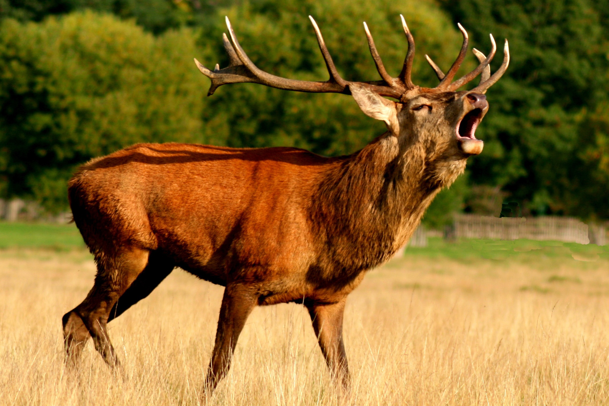

<!--
Opening scene: Humans always engineered connectivity.
We’ll move from voice to horns, roads, writing, and beacons.
-->

---

# The Oldest Signal

## Language

- First long-range signal
- Limited by lungs, terrain and weather or city noise
- Might wake you

<!--
Whistling appears all over as languages to cover great distances in remote landscapes
-->

---

# Amplifying Sound

.jpg)

## Horns & Lurs

- Extend range of human sounds
- Range still limited

<!--
Longer range than whistling
-->

---

# Bonfire Beacons (*Vårdkasar*)

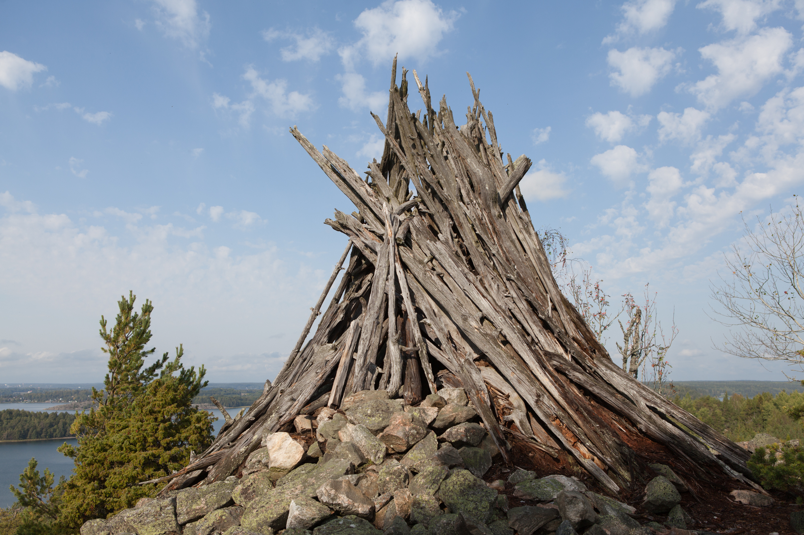

## Swedish Coastal Beacons

- Optical approach
- Longer range, especially in dark
- Won't wake you unless practically on fire

<!-- vårdkasar as Stockholm’s alarm network. Going optical for greater range -->

---

# Roads as Infrastructure

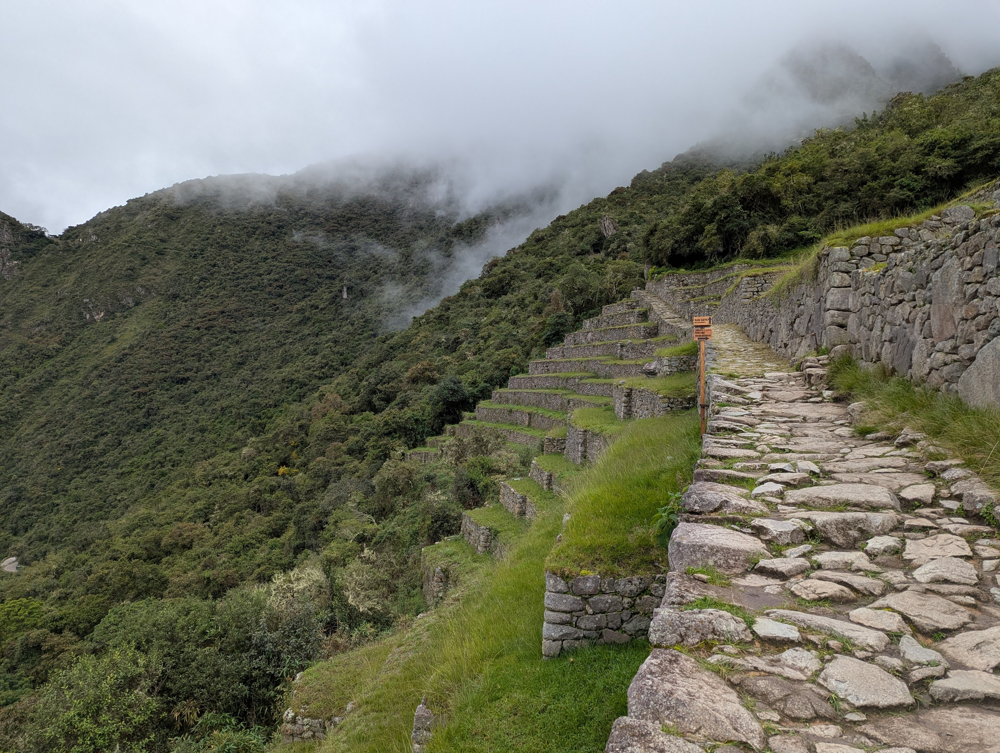

## Trails and Running

- Bruteforcing it

<!--
Personal photo from Inca Trail. Bruteforcing roads and bruteforce running at crazy altitudes. Actually staffet and very speedy even compared to modern roads that do not climb well.
-->

---

# Seasons and dates

<!--
Chapter 2 opens the "time" thread:
time as prediction, coordination, and power.
We’ll move from calendars and clocks to the idea that data without time is noise.
-->

---

# Gathering Data

## Measuring seasons

- Patterns become calendars
- Seasons become predictable

<!--
Image of stonehenge on a cloudy day. The test equipment for measuring the sun and seasons in relation to days must be sturdy. Imagine if someone toppled a rock on a solstice that wasn't cloudy. no wonder they overengineered it.
-->

---

# Hungerstones and drought

.JPG)

## Recording water levels

- Data → when to plant
- Data → famine warning

<!--
There are hungerstones that were put in dry rivers to warn future generations when there is danger of drought.
-->

---

# God kings

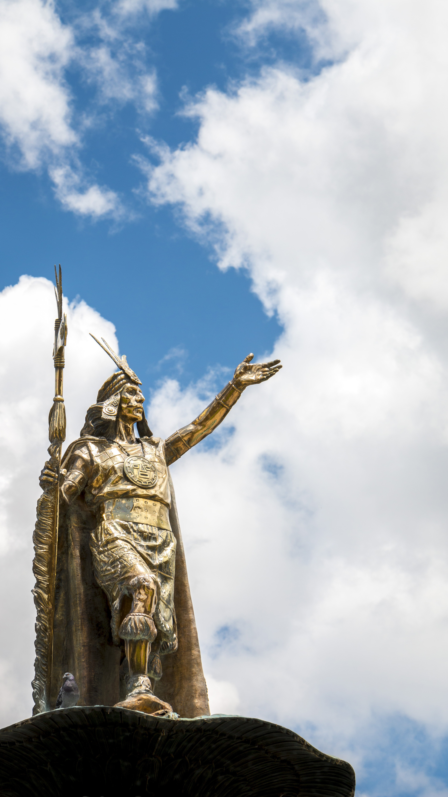

## Providing information

- Agricultural timing
- Administration & taxes

<!--
Put it all together and you could become a farao or inca or godking. Seems as true today as then when we consider the worlds richests.
-->

---

# Dates and time

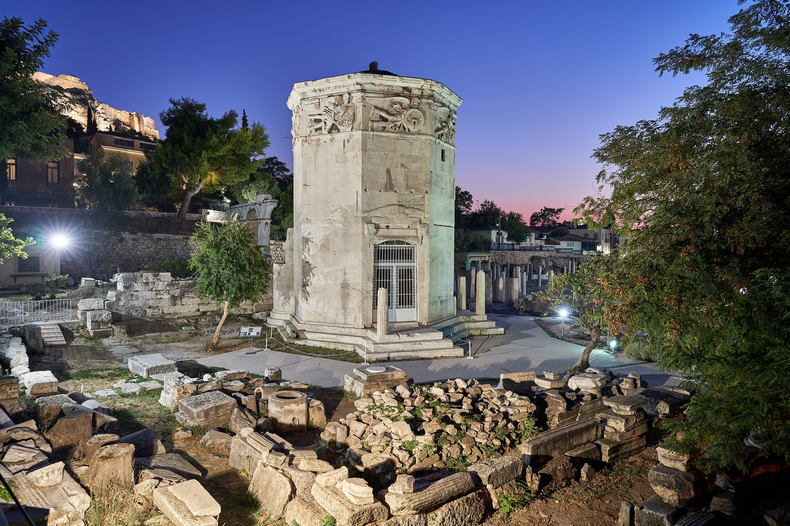

## Tower of winds, Athens

- The earliest still existing mechanical clocktower
- Daily schedule and synchronization

<!--
Well preserved, some 2000 years old. A true master of time.
-->

---

# Measuring the World

<!--
Chapter 3: Astronomy & Geometry.
Image, pale blue dot from the voyager mission. Taken in 1990, remastered by nasa in 2020, at a distance of 6 billion kilometers from the sun
-->

---

# Pythagorans

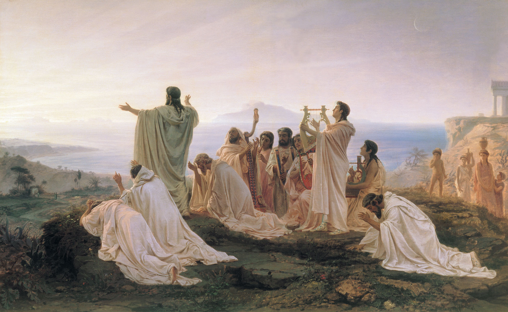

## Harmony in Numbers (~500 BC)

- String ratios = musical intervals
- Math revealed in sound
- Right-angled triangles
- Math links space and sound

<!--
Pythagoras found octaves, fifths, and fourths by plucking a string at different lengths.
Early connection between mathematics, resonance, and harmony.
The Pythagorean theorem and string ratios both trace back to the same thinker.
Geometry and resonance enter Western science together.
Pythagorans were his hippie-like intelectual community.
-->

---

# Actually measuring the world

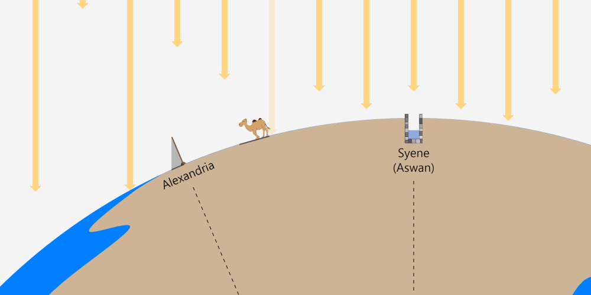

## Eratosthenes used Shadows as Data

- Syene: no shadow
- Alexandria: shadow angle
- Geometry → Earth’s size

<!--
Eratosthenes measured the Earth with two sticks and math.
An early global-scale engineering experiment.
-->

---

# Triangulation

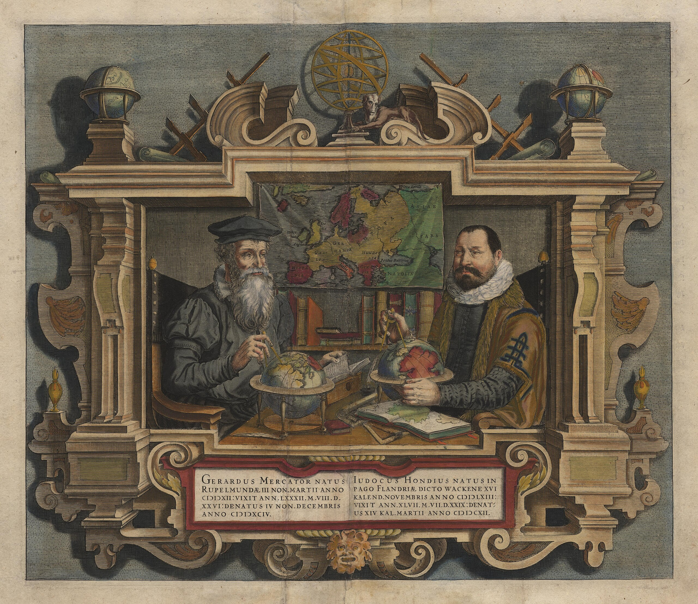

## Angles to Maps

- Measure baselines
- Extend with triangles
- Accurate geography

<!--
Gerardus Mercator 1512, 1569 world map based on a new projection which represented sailing courses of constant bearing (rhumb lines) as straight lines—an innovation that is still employed in nautical charts. He made the Atlas in 1595. Mercator projection, a modern version, is used today for online maps by Google and OSM. Not same as longitude and latitude but convertable. However, GPS and NMEA uses longitude and latitude.
-->

---

# Canons & Rangefinding

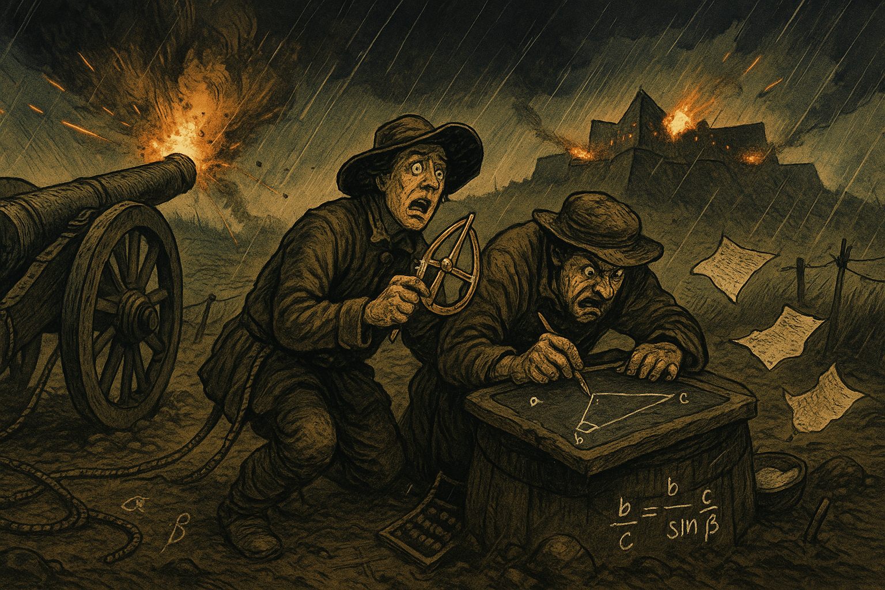

## War Drives Precision

- Hitting unseen targets
- Requires angles & math

<!--
Dark comedy picture of gunners doing the most desperate math under fire to aim their canon at a star fortress.
-->

---

# Optics

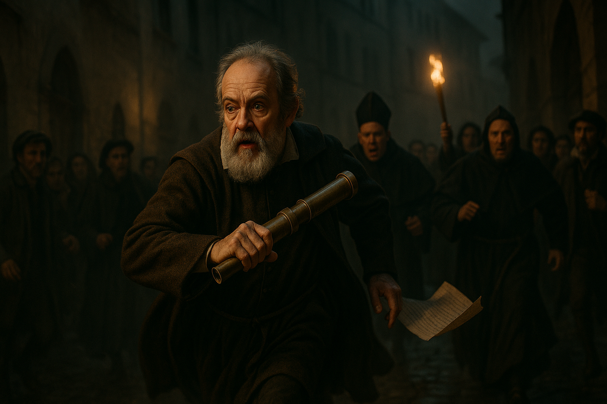

## Galileo Galilei (1564)

- Perfected the early refracting telescope

<!--
Eventually people figured it was clever to spy on enemies with spying glases. Galileo Galilei didn't and was hunted by the church. They forgave him in 2000.
-->

---

# Acoustics

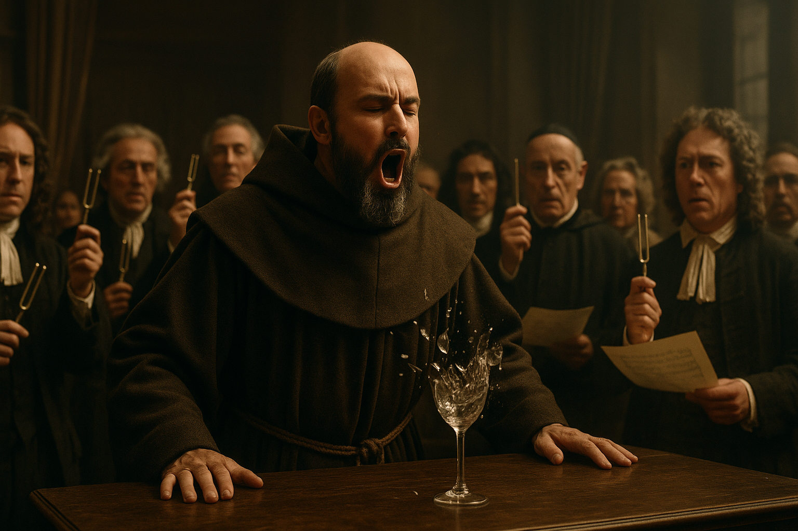

## Marin Mersenne (1637)

- Laws of vibrating strings
- Frequency ∝ length, tension, mass

<!--
The pythograns would probably have been more please with the advancments in Acoustics,
which translates directly to light, RF and modern antenna designs.
Mersenne formalized acoustic science in *Harmonie Universelle*.
Bridges music, resonance, and physics.
Marin Mersenne: AI image of Marin Mersenne crushing a glass with his voice. We take liberties.
-->

---

# Positioning - Navigation

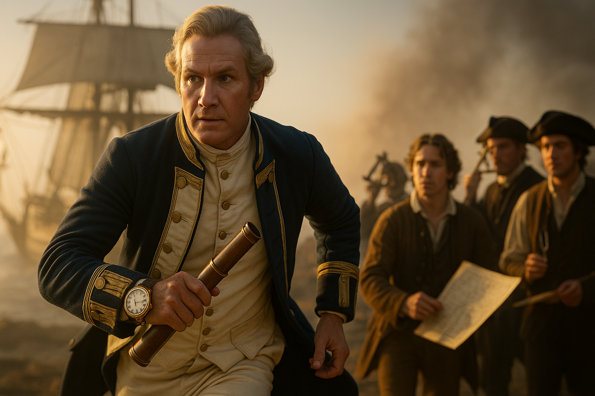

## Latitude

- Could be measured anywhere by observning the angle of celestial objects over the horizon.

## Longitude

- Required exact timekeeping to measure the time from GMT to the local noon.

<!-- James Cook (1728) used a watch. The Kendal K1 was the real watch he used and praised -->

---

# Optical telegraph network

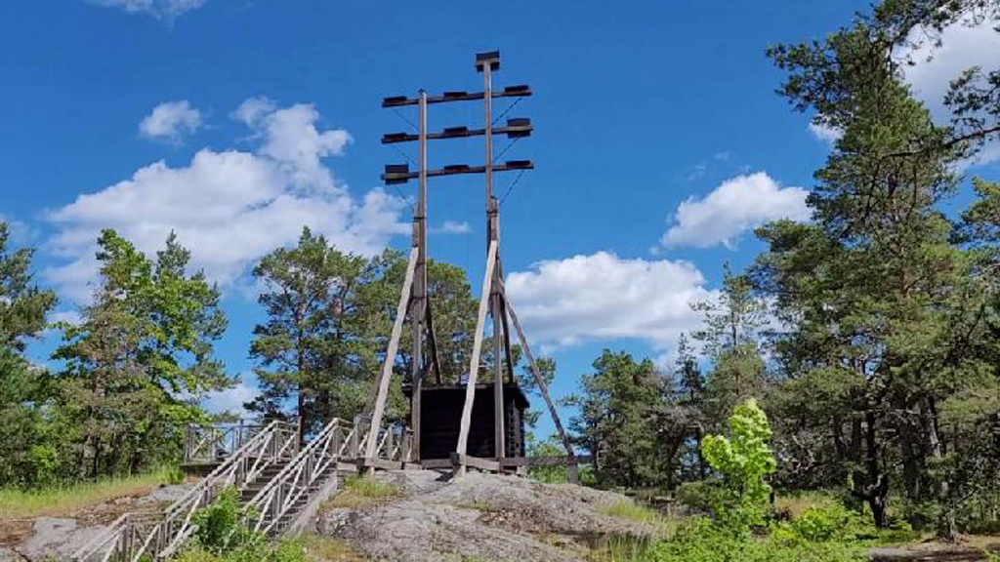

## Edelcrantz telegraphs in Stockholm, 1795-1881

- Based on french system

<!-- Now we are practically in modern times and electricty and RF is about to replace connectivity for over a century until fiber optics rises from the grave -->

---

# Electricity

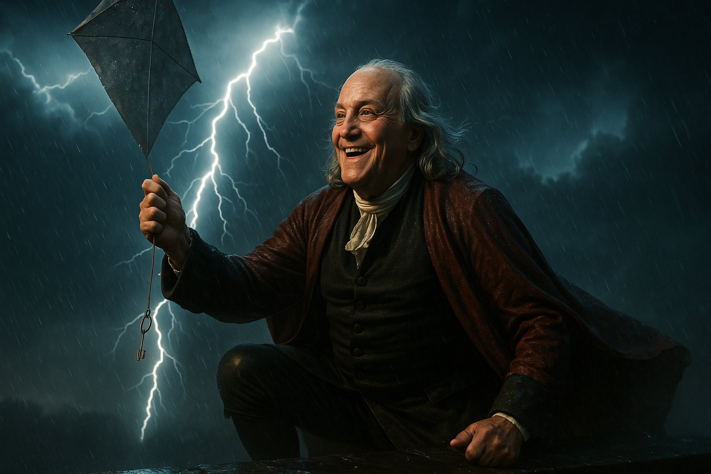

---

# Light is Electromagnetic waves

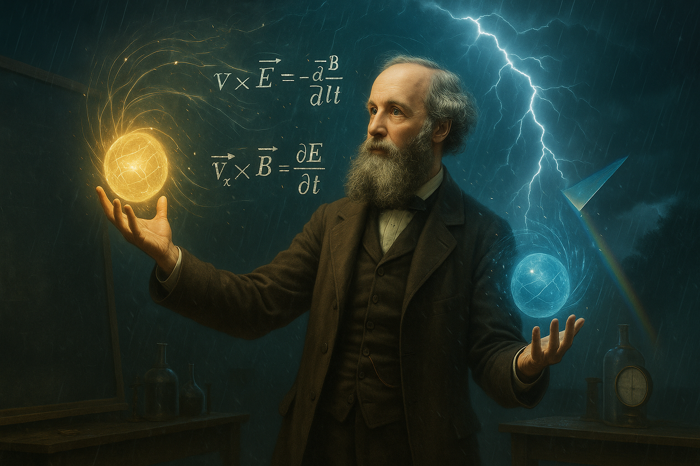

- Light is high frequency, 400-750 thz, or 700-400 nm wave lengths
- Electricity, direct current, is frequency 0hz.
- Electricty, AC 50hz, 6000 km wave length...needs a long antenna.

---

## Wires are also antennas

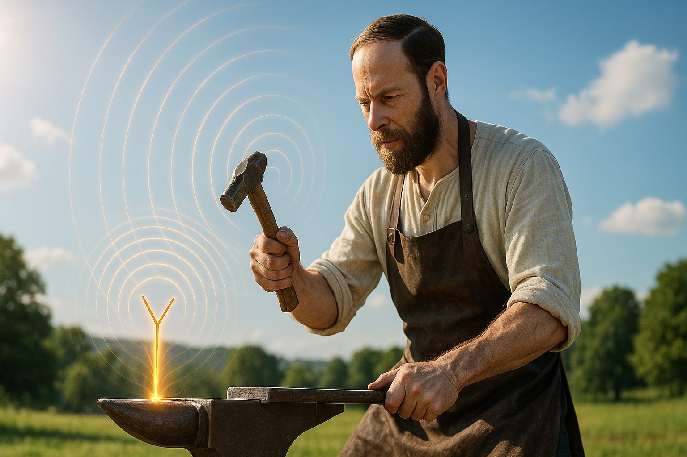

- As frequency increaes, em fields stop following conductors
- As frequency increases further, radiating EM fields starts bouncing
- Light easily reflects off any surface
- 5g, also a high frequency, bounces some

---

# Electrons and photons

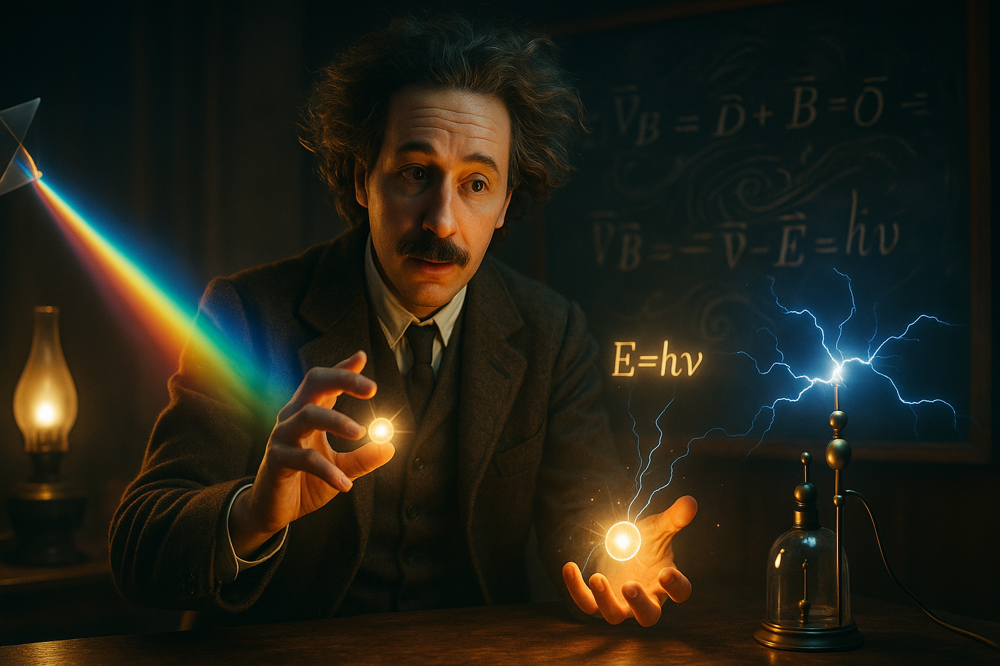

- Electrons are charged particles
- Electrons move freely in metals making them conduct EM fields
- Photons add energy to the field when entering
- Photons draw energy from the field when leaving

<!-- Einstain found the photelectric effect in 1905 -->
---

# Heat

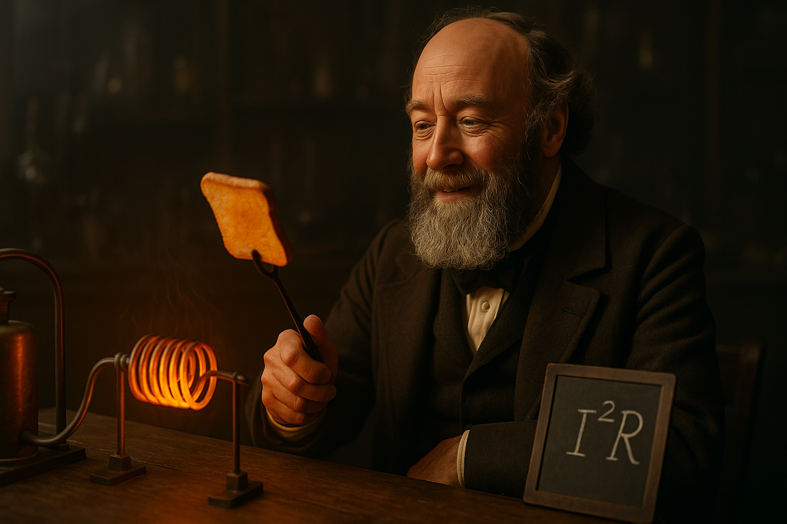

<!-- James Prescott Joule toasting bread. Found the first law of thermodynamics in 1843 -->

---

# DC currents (0 Hz)

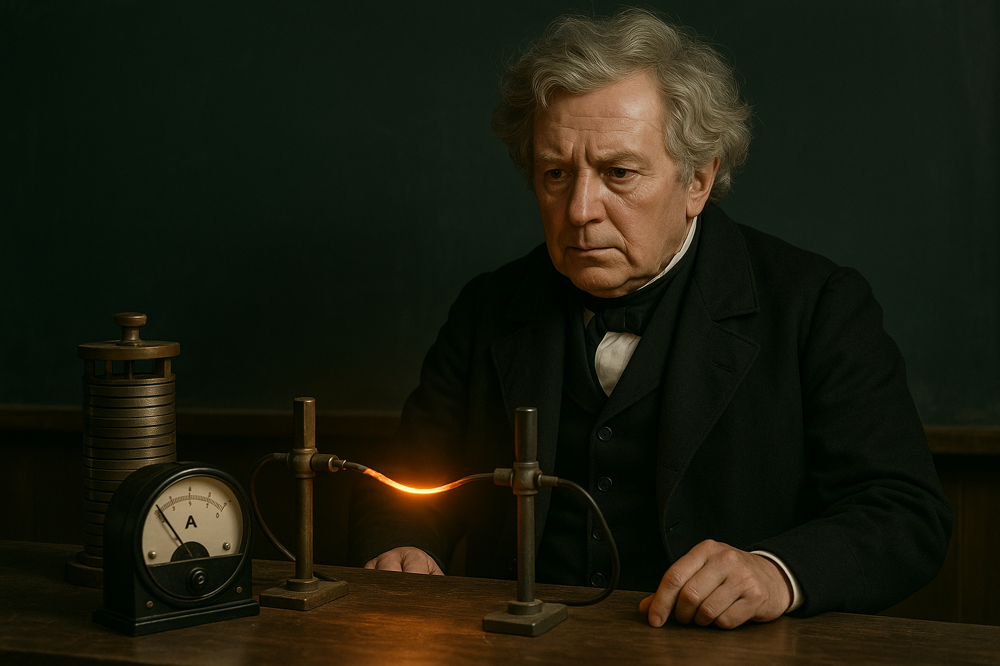

- No radiation by itself
- Resistive losses (I²R) heat the conductor
- As it warms, it glows: IR → red hot → white hot
- Radiation is broad and random (thermal), not a signal

<!-- Goerg Ohm, 6 March 1789 – 6 July 18  -->

---

# Induction heating

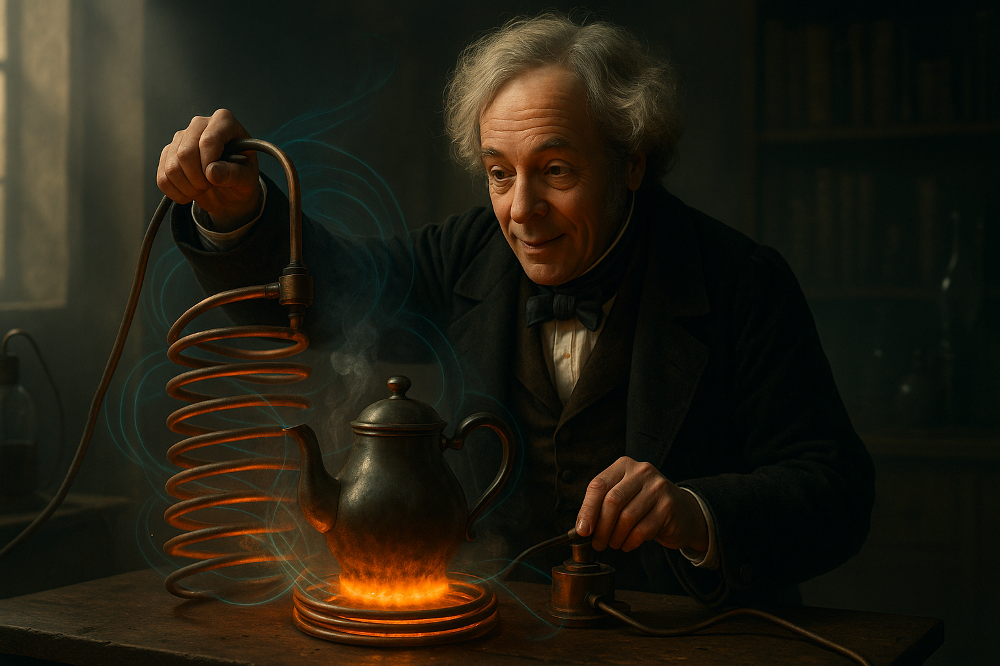

- Uses high-frequency AC (kHz–MHz)
- Changing magnetic field induces **eddy currents** in nearby metal
- Eddy currents heat the metal locally
- More efficient with ferromagnetic materials (iron, steel)

<!-- Farraday making tea -->

---

# Inductive charging

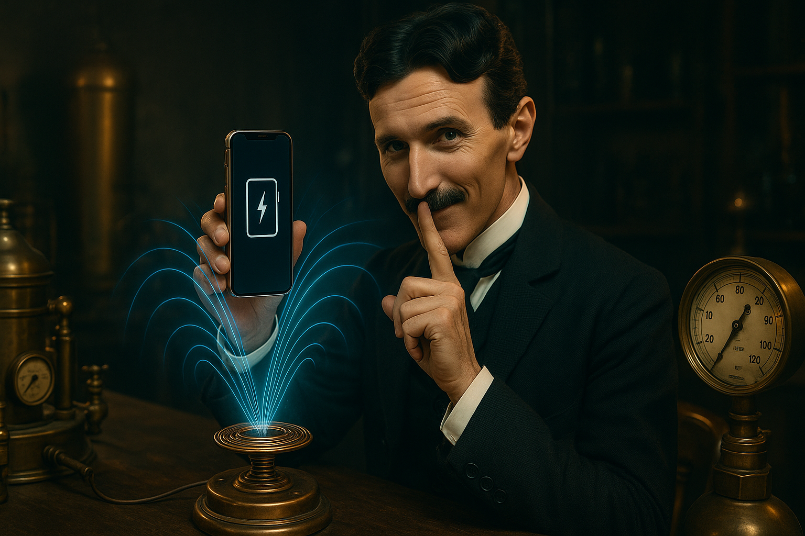

- Also uses high-frequency AC
- But instead of wasting energy as heat, a **receiving coil** picks up the changing field
- Energy is captured and converted back into DC for batteries
- Same principle as a transformer, but without a solid core

<!-- Tesla sending electrictiy over the air -->
