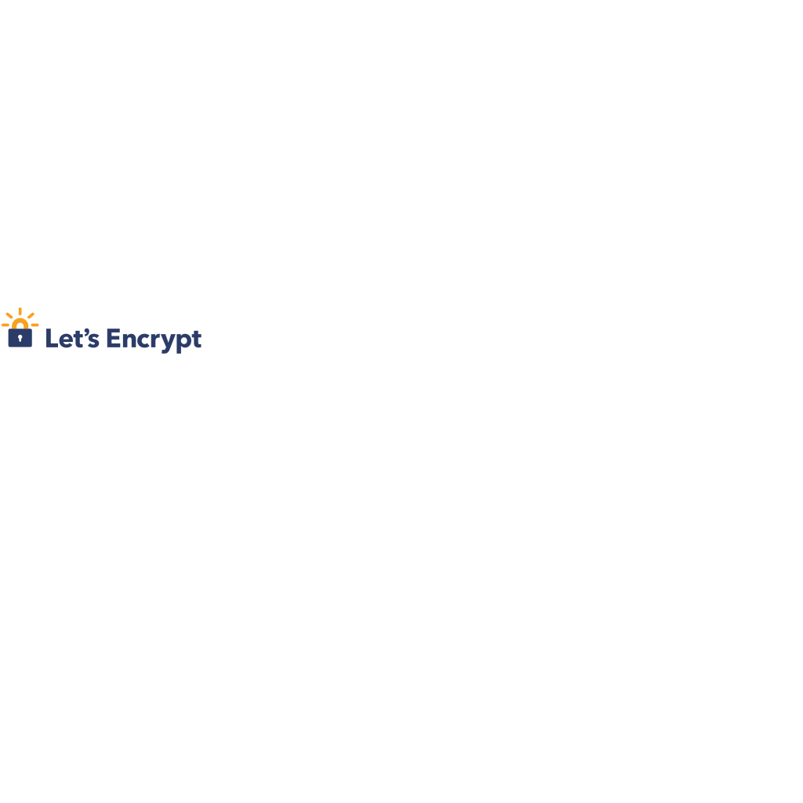
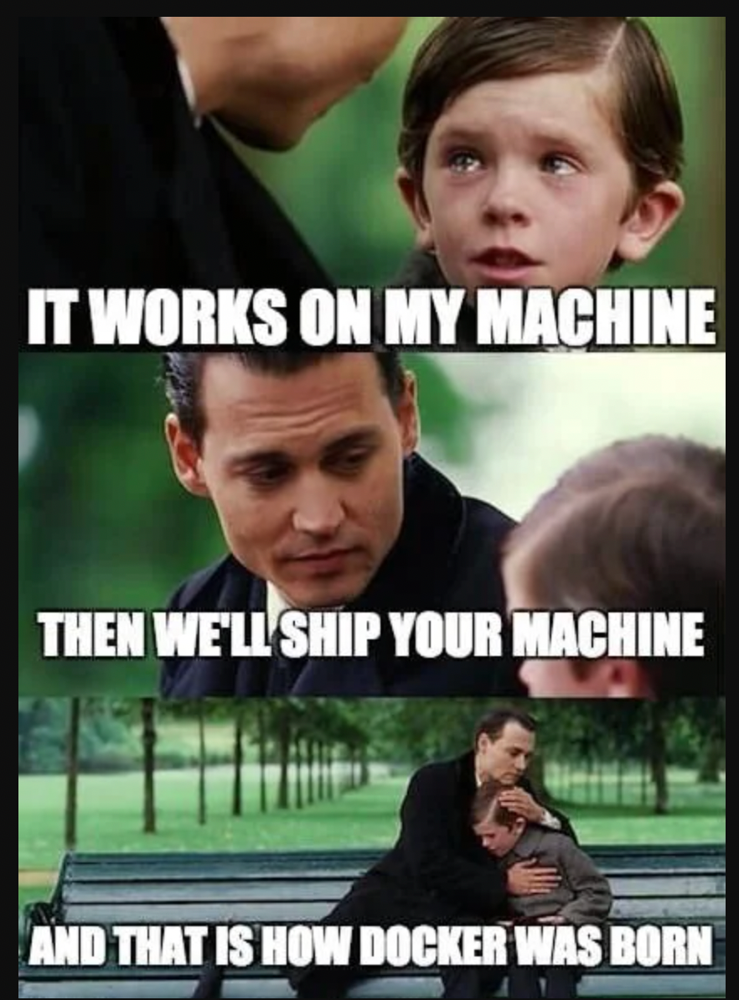

# The S in IoT stands for Security

<!--
Old internet proverb: The S in IoT stands for Security
-->

---

# Secure Hypertext Transfer Protocol (HTTPS)



- HTTP uses TCP for transport and IP for addressing, a.k.a TCP/IP and is unencrypted
- HTTPs is HTTP with TLS (Transport Layer Security) encryption
- TLS replaces the older SSL (Secure Sockets Layer) protocol
- Encrypts data between client such as a browser or app and server
- Server use certificates issued by trusted Certificate Authorities (CAs)
- Client checks if the CA is trusted and if so, checks with the CA if the certificate is valid

<!--
The only CA practically used on the web today is Let's Encrypt because it's free and automated. Before it used to be expensive to get a certificate.
-->

---

# Mutual TLS (mTLS)


- Both client and server authenticate each other using certificates
- Common in IoT and enterprise environments, such as for MQTT over TLS (MQTTS)
- Enhances security by ensuring both parties are trusted
- The server only talks to verified clients and clients only to verified servers
- More complex to set up and manage due to the need for client certificates
- In IoT when firmware is used anyway, adding a client certificate in production is not a big deal

<!--
This is what we did in Lesson 1, when decrypting the Mqtts traffic using Wireshark and the key log dump.
-->

---

# Certifcate generation with OpenSSL

- When setting up TLS or mTLS, you need certificates
- For web servers, you can get free certificates from Let's Encrypt
- For testing and internal use, you can create your own CA and issue certificates using OpenSSL
- For mTLS, you need to create a client certificate as well
- IoT cloud services often support mTLS for enhanced security and provide root certificates for their services
- You can use OpenSSL to generate private keys, CSRs (Certificate Signing Requests), and sign certificates

<!--

We can see how this is done in the code examples.
When running in bash on windows, globbing breaks scripting so a that's why the scripts have an initial dummy argument when defining subject ("//windows=fix/C=SE/ST=Stockholm/L=Nacka/O=Nackademin/CN=").
All those values can be anything, but CN (Common Name) is often the hostname or email address.
Then certificates can have properties such as SAN (Subject Alternative Name) to allow multiple hostnames or IP addresses that the certificate is valid for. Some browsers require SAN to be set. Custom clients and servcers can choose to ignore it or enforce diffrent rules depending on the use case and security needs.

-->

---

# Certifcate signing requests newer shares the private key

- When provisioning a secure device, you typically generate a private key and CSR on the device itself
- The private key never leaves the silicon and remains secret
- OTP (One Time Programmable) memory or secure elements can be used to store the private key securely
- Sometimes also called burning the key into the device, or burning the efuses
- Failures tends to brick the device, so care is needed

---

# Hashes

- A hash is a fixed-size string or number generated from input data of any size
- Common hashing algorithms include MD5, SHA-1, and SHA-256
- Hashes are used for data integrity verification, password storage, and digital signatures
- Git uses SHA-1 hashes to identify commits. It's the cryptic number you see in commit logs
- Passwords are often stored as hashes in databases to avoid storing the actual password
- Hashes enables CSRs so that the CA can sign the certificate without ever seeing the private key

---

# SSH, SCP and SFTP

- SSH (Secure Shell) is a protocol for secure remote login and command execution
- SCP (Secure Copy) and SFTP (SSH File Transfer Protocol) are used for secure file transfers over SSH
- SSH uses public key cryptography for authentication and encryption
- SSH keys can be generated using tools like `ssh-keygen`, which is just a script that uses OpenSSL under the hood
- SSH keys consist of a private key (kept secret) and a public key (shared with others)
- SSH is asymmetric encryption, meaning different keys are used for encryption and decryption

---

# Terminals

- A terminal is a text-based interface for interacting with a computer system
- POSIX defines a standard for command line interfaces, which is used by Unix, Linux, and macOS
- PowerShell is POXIS-like and available on Windows, Linux, and macOS
- POSIX shells runs shell scripts, which are text files with commands to be executed in sequence

> If logging into a docker container in docker desktop, you might end up in a sh shell, which is POSIX compliant but has very few features. Try running `bash` and see if it's common and more user friendly.

---

<!--
People might think of them as DOS, which is a specific (headless) operating system that uses a command line interface (CLI). DOS means Disk Operating System and was popular in the 80s and early 90s before Windows took over. It wasn't standardized and had many different versions for many different hardware platforms spanning several decades.
POSIX is more than just a command line interface, it also defines APIs for file systems, process management, and other system calls. It is a standard that ensures compatibility and interoperability between different operating systems and software. Zephyr has a POSIX compatibility layer, but it's not a full POSIX implementation. It provides a subset of POSIX APIs that are useful for embedded systems, but not all POSIX features are available. It does some file system emulation, which makes dealing with memory easier, but it's not a full file system implementation.
-->

# Shortest app

What’s the shortest program you could write to download a compressed archive containing a 1gb large CSV file, parse it and then connect to a server using SSH that runs an SQL database and insert the content?

---

# CSV database update script

```bash
curl -sSL "$URL" | gzip -dc | { IFS=, read -r _; while IFS=, read -r ts k v; do printf "INSERT INTO measurements(ts,k,v) VALUES (%s,'%s','%s') ON DUPLICATE KEY UPDATE v=VALUES(v);\n" "$ts" "$k" "$v"; done; } | ssh dbuser@dbhost 'mysql -N mydb'
```

---

# Piping and streaming data processing

- The pipe operator `|` takes the output of one command and uses it as the input for another command
- This allows for chaining commands together to create complex workflows
- Each command in the pipeline runs concurrently, passing data along as it becomes available
- Kind of line enumerators and dot chaining

---

# ...enumerators and dot chaining...

- In programming, enumerators are objects that allow you to iterate over a collection of items
- Dot chaining is a technique where multiple methods are called on an object in a single line, using the dot operator to separate each method call
- Both concepts are used to create more readable and concise code
- Similar to how pipes work in shell scripting, where the output of one command is passed as input to the next command
- Streaming data processing in languages like JavaScript and Python often use these concepts to handle data efficiently without loading everything into memory at once for each step

<!--
Maybe you looked into these?
Very popular today along with lambda functions and await async programming.
-->
---

# Back to pipes and the CSV example

- The `curl` command downloads the compressed CSV file from the specified URL
- The `gzip -dc` command decompresses the downloaded data on the fly
- The `while IFS=, read -r ts k v; do ... done;` loop reads each line of the CSV into variables.
- The `printf` command formats the SQL insert statement for each row
- The final `ssh` command connects to the remote database server
- The ssh argument is the command to run on the remote server, which in this case is a MySQL command to insert the data into the database

<!--
There are countless other linux commands that can be chained together using pipes to create powerful data processing workflows. And if you lack a specific command, you can often write a small script in bash, python, perl, awk, sed or any other scripting language to fill in the gap.
-->

---

# Running Linux, besides dual booting or virtual machines

- Windows 10 and 11 have WSL (Windows Subsystem for Linux) which allows you to run a full Linux environment on Windows
- You can install Ubuntu from the Microsoft Store
- Docker Desktop is another way to run Linux containers on Windows and MacOS
- Android 16 also has a full Linux kernel and can run Linux apps natively

<!--
Android 16 also got DisplayPort over USB-C with Desktop mode based on Samsung DeX. So you can connect your phone to a monitor, keyboard and mouse and use it as a desktop computer run your python scripts and ssh into your servers. Pretty neat for a phone.

It's rather weird because IPhone now has fun hardware with air tags using UWB (Ultra Wide Band) and Lidar for real time 3D scanning. We'll talk more about UWB later in the course when we cover RF in more detail.
-->

---

# GitHub SSH Key Mini-Challenge!

- If you haven't already, generate an SSH key pair using `ssh-keygen`
- Add the public key to your GitHub account under "SSH and GPG keys"
- Use SSH URLs for your GitHub repositories to clone and push changes securely

---

# NetBird SSH login challenge!

- Use NetBird to create a group
- Create a throw-away docker running SSH server with a user and password connected to the NetBird group
- In NetBird, create a setup key that includes the group by default
- Create a throw-away docker running the NetBird client using the setup key
- From the throw-away client, SSH into the SSH server

---

# NetBird SSH login challenge 2!

- Once connected, sign the guestbook

```bash
echo "Hello from $(hostname) at $(date)" >> /guestbook.txt
```

- Read the guestbook from the server

```bash
tail -f /guestbook.txt
```

- Press `Ctrl-C` to stop reading the guestbook then type `exit` to leave the SSH session

<!--
Manchester encoding solves timing without a separate clock line.
Used in classic Ethernet, RFID tags.
-->

---

# Redirecting input and output

- The `>` operator redirects the output of a command to a file, overwriting the file if it exists
- The `>>` operator appends the output of a command to a file, creating the file if it doesn't exist
- The `<` operator redirects the input of a command from a file instead of standard input
- The `2>` operator redirects standard error (stderr) to a file
- The `&>` operator redirects both standard output (stdout) and standard error (stderr) to a file

---

# ...you probably remember these from your programming courses...

- In **general purpose programming languages**, input and output redirection is often handled using standard libraries or built-in functions
- And you probably noticed they are not in SQL, which is a **domain specific language** or 3rd level language
- 2nd level languages are assembly languages, which are low level and close to the machine code, but still human readable
- 1st level languages are machine code, which is binary and not human readable...

<!-- you probably already heard about compiled vs interpreted languages or static vs dynamic typing... and maybe even procedural vs object-oriented vs functional programming... but in case you haven't heard about these... -->

---

# How does NetBird and similar tools work?

- NetBird uses WireGuard for secure, encrypted connections between devices
- WireGuard is a modern VPN protocol that is fast, simple, and secure
- WireGuard uses UDP for transport, which is connectionless and does not guarantee delivery unlike TCP
- UDP hole punching is used to establish direct connections between devices behind NAT (Network Address Translation) routers

<!--
Normal home routers use NAT to allow multiple devices to share a single public IP address

Think of the router like a classic phone switchboard operator, connecting calls between different parties. The operator needs to know where to route the call, which is similar to how NAT routers need to know where to send incoming packets based on the mappings created by outgoing packets.

On, and our LwM2M Zephyr client also uses UDP for transport. It uses CoAP (Constrained Application Protocol) which is a lightweight protocol designed for resource-constrained devices and networks. While it doesn't maintain a persistent connection like TCP, it is a two-way protocol that allows for request-response communication between clients and servers. Keep-alive messages can be used to keep the NAT mappings active. So you will be able to connect to the device from the server as long as the mapping is active. This works well for many IoT use cases where devices need to send and receive data periodically. The latency and reliability of UDP can be a concern for some applications, but for many IoT use cases, the benefits of using a lightweight protocol like CoAP outweigh the drawbacks. MQTT uses TCP for transport, which provides reliable, ordered delivery of messages. This can be important for applications where message delivery is critical, such as in industrial automation or healthcare. Latency in MQTT can be higher than in UDP-based protocols like CoAP, but the reliability and ordering of messages can be more important for certain applications.
-->

---

# ICE and TURN servers

- NetBird uses ICE and TURN servers to help devices connect with each other, even if they are behind NAT routers or firewalls.
- ICE (Interactive Connectivity Establishment) helps devices discover the best way to connect with each other by trying different methods and paths.
- STUN (Session Traversal Utilities for NAT) is used to discover public IP addresses and ports.
- TURN (Traversal Using Relays around NAT) servers act as intermediaries to relay traffic between devices when direct connections are not possible. It's a last resort because it adds latency and costs money to run the servers.

<!--
Browsers use ICE and TURN servers for WebRTC (Web Real-Time Communication) to enable peer-to-peer connections for video calls, file sharing, and other real-time applications. Teams, Zoom, and Google Meet all use these technologies to connect users. There is also a BitTorrent extension for WebRTC to allow peer-to-peer file sharing directly in the browser without needing a separate BitTorrent client. You can try it out at https://webtor.io/ or share files from your webbrowser using https://instant.io/
-->

---

# Docker Born



---

# Docker Containers and Docker Compose

- Docker is a platform for developing, shipping, and running applications in containers.
- They can be push and pulled from container registries like Docker Hub or GitHub Container Registry.
- A container has an image and one or more volumes for persistent data.
- Docker Compose is a tool for defining and running multi-container Docker applications using a YAML file.
- Dockerfiles are used to define the contents and configuration of a Docker image.

<!--
Restarting Windows often helps if Docker Desktop misbehaves.
If a docker fails to start, check if another docker or process is using the same port.
-->

---

# Dockerfile

```Dockerfile
# use ubuntu as base image
FROM ubuntu:24.04

# Install wget and java jre
RUN apt-get update && apt-get install -y wget default-jre && apt-get clean && rm -rf /var/lib/apt/lists/*

WORKDIR /app

# Download leshan demo server
RUN wget https://ci.eclipse.org/leshan/job/leshan-ci/job/master/lastSuccessfulBuild/artifact/leshan-demo-server.jar

# Run the leshan demo server
CMD java -jar leshan-demo-server.jar
```

<!--
We used to use ubuntu 22.04, but leshan requires a newer java so we fixed it by bumping to 24.04
Using a fixed version like this is good practice to avoid breaking changes in the base image.
-->

---

# Project Ideas

- Make your own peripeheral using a microcontroller such as an Arduino, ESP32, Raspberry Pi Pico or similar
- Make a mass storage device using a Raspberry pi Zero that also connects to your wifi and can be accessed over the network
- Skip hardware and make a virtual peripheral using a script that simulates a sensor or actuator
- Go crazy and make a robot or drone or 3d printer. Check for existing open source projects that can be completed in time
- Boring onboarding to Wifi networks using bluetooth or toggle a device between access points to run a web server for setting up wifi credentials

---

# More Project Ideas

- Simple ML project for brake lights with an accelerometer or automatic p-skivor that sets the time when the car stops.
- Home automation using a raspberry Pi or similar
- Android or IOS or Python app that scans for bluetooth devices and shows info about them and logs them to a database
- Figure out how to connect to the Nackademin WiFi using Linux
- Bluetooth scale with an app that helps you mix cocktails by telling you what to add, when to stop pouring, when to start drinking and when till fill up again

---

# Python challenge!

- Python scripts can run using systems python interpreter
- Many linux distributions comes with python and packages pre-installed used by the system
- Python projects should use virtual environments to avoid dependency conflicts
- Try using VSCode to create and manage the virtual environment and dependencies
- Install the Python extension in VSCode
- Press Ctrl+Shift+P to open the command palette and use "Python: Create Environment"

---

# Questions?

- Monday: InfluxDB + Grafana + mTLS termination with Nginx.
