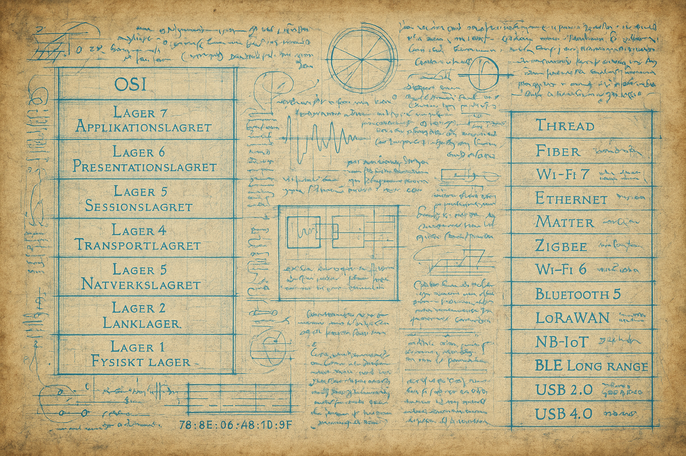

# OSI Modellen

---

## OSI Modellen: Kan användas för att jämföra anslutningstyper

| OSI Layer                     | Bluetooth/GATT                                                | LoRaWAN                                                                               | ZigBee                                                                            | LwM2M/CoAP over UDP                                                        | HTTP                                                                             | MQTT                                                                                     | Modbus over RS485                                             | CAN                                                                     | Thread                                                                | Matter                                                                             |
| ----------------------------- | ------------------------------------------------------------- | ------------------------------------------------------------------------------------- | --------------------------------------------------------------------------------- | -------------------------------------------------------------------------- | -------------------------------------------------------------------------------- | ---------------------------------------------------------------------------------------- | ------------------------------------------------------------- | ----------------------------------------------------------------------- | --------------------------------------------------------------------- | ---------------------------------------------------------------------------------- |
| Lager 1 - Fysiskt lager       | Bluetooth-radiovågor, modulation                              | LoRa-radio, modulation (chirp spread spectrum)                                        | ZigBee-radio, baserat på IEEE 802.15.4                                            | Använd fysisk länk som stöder IP-nätverk                                   | Ethernet, Wi-Fi, eller liknande fysisk länk                                      | Ethernet, Wi-Fi eller liknande fysisk länk                                               | RS485 fysisk länk (tvåtråds eller fyrtråds system)            | CAN-buss (Controller Area Network) fysisk överföring                    | IEEE 802.15.4-bas för trådlös kommunikation                           | Baserat på Thread (IEEE 802.15.4) eller Wi-Fi                                      |
| Lager 2 - Länklager           | Baseband, LMP (Link Manager Protocol)                         | LoRaWAN MAC layer                                                                     | ZigBee MAC layer (IEEE 802.15.4)                                                  | LoWPAN eller liknande, beroende på nätverksteknologi                       | Data link (t.ex. Ethernet eller Wi-Fi protokoll)                                 | Data link (Ethernet eller Wi-Fi)                                                         | RS485 elektrisk specifikation för länkkommunikation           | CAN-protokoll för dataöverföring och felhantering                       | IEEE 802.15.4 MAC layer                                               | MAC layer beroende på underliggande teknik (t.ex. 802.15.4 eller Wi-Fi)            |
| Lager 3 - Nätverkslagret      | Ej tillämpbart direkt (men kan stödja IP via andra protokoll) | LoRaWAN använder IPv6, men nätverkslaget hanteras av Gateways och Network Servers     | ZigBee Network Layer (stödjer mesh routing)                                       | IPv6 routing (används med 6LoWPAN)                                         | IP (Internet Protocol)                                                           | IP (Internet Protocol)                                                                   | Modbus RTU-adressering och routing                            | CAN-används ej för klassiskt nätverkslager, ingen routing               | IPv6-baserad nätverkskommunikation med mesh-routing                   | IPv6-baserad kommunikation                                                         |
| Lager 4 - Transportlagret     | L2CAP (Logical Link Control and Adaptation Protocol)          | UDP över IP (används i gateway/server-lösningar)                                      | ZigBee Transport layer (utbyte av paket mellan noder)                             | UDP som transportlager                                                     | TCP som transportlager                                                           | TCP som transportlager (MQTT kräver en stabil anslutning)                                | Modbus överför dataramar (framing) på transportlagret         | CAN-ramar (frames) hanteras direkt på transportlagret                   | UDP som transportlager (baserat på IP-kommunikation)                  | UDP eller TCP beroende på applikationen                                            |
| Lager 5 - Sessionslagret      | ATT (Attribute Protocol)                                      | Sessionshantering med krypterade nycklar (för både nätverk och applikation)           | Sessionslagret hanteras av ZigBee Application Support Sub-layer                   | CoAP hanterar sessionslagret med enkla metodik som GET, POST, PUT, DELETE  | HTTP hanterar sessionslagret med tillståndslösa förfrågningar (request/response) | MQTT hanterar sessionslagret genom att upprätthålla anslutningar och övervaka abonnemang | Sessionslagret är implicit genom adressering och sekvensering | Sessionslagret är inte specificerat, data skickas kontinuerligt         | Sessionshantering via standard IPv6-metoder (t.ex. CoAP eller TCP)    | Sessionshantering för enhetsstyrning och applikationsutbyte                        |
| Lager 6 - Presentationslagret | Data format, GATT services och characteristics                | Ej specifikt presentationslager, men dataformat är definierat i applikationen         | Presentationslagret är applikationsspecifikt, kan variera                         | Presentationslagret kan definiera dataformat med LwM2M-resurser och objekt | Presentationslagret använder format som JSON, HTML, XML för att presentera data  | Presentationslagret använder specifika payload-format som kan variera                    | Enkelt presentationslager för dataregister                    | Ej specifikt presentationslager, men meddelandestrukturen är definierad | Presentationslagret är applikationsspecifikt, definieras av användare | Presentationslagret definierar interoperabilitet och dataformat för smarta enheter |
| Lager 7 - Applikationslagret  | GATT (Generic Attribute Profile)                              | Applikationslagret hanteras av specifika applikationsservrar, kryptering för payloads | ZigBee Application Framework (specifik för olika profiler, t.ex. Home Automation) | LwM2M-applikationsprotokoll som styr enheter och sensorer                  | HTTP-protokollet fungerar på applikationslagret för webbtjänster                 | MQTT fungerar på applikationslagret för publicering/abonnemang av meddelanden            | Modbus applikationsprotokoll för att läsa/skriva register     | Applikationsspecifika CAN-protokoll, t.ex. CANopen eller J1939          | Thread-protokoll stöder IP-baserade applikationer, såsom Matter       | Matter applikationsprotokoll för smarta hem-enheter                                |

---

## Dataöverföringshastigheter, räckvidder och topologier

| Teknik                 | Maximal Hastighet  | Maximal Räckvidd     | Topologi                  | Användningsområde                                     |
| ---------------------- | ------------------ | -------------------- | ------------------------- | ----------------------------------------------------- |
| **Ethernet**           | Upp till 100 Gbps  | 100 meter            | Punkt-till-punkt          | Industriella gateways, pålitliga anslutningar         |
| **Fiber**              | Upp till 1 Tbps    | Flera mil            | Punkt-till-punkt          | Hög hastighet i industriella miljöer, lång räckvidd   |
| **Wi-Fi 7**            | Upp till 46 Gbps   | 50-100 meter inomhus | Stjärn-/punkt-till-punkt  | Högpresterande smarta hem, industriella applikationer |
| **Wi-Fi 6**            | Upp till 9,6 Gbps  | 50-100 meter inomhus | Stjärn-/punkt-till-punkt  | Smarta hem, kameror, gateways med hög bandbredd       |
| **Thread**             | Upp till 250 kbps  | Upp till 100 meter   | Mesh                      | Smarta hem, industriella IoT-nätverk med låg energi   |
| **Bluetooth 5**        | Upp till 2 Mbps    | Upp till 200 meter   | Punkt-till-punkt          | Wearables, trådlösa sensorer                          |
| **BLE Long Range**     | Upp till 125 kbps  | Upp till 1 kilometer | Punkt-till-punkt          | Långdistanssensorer, lågenergienheter                 |
| **BLE Mesh**           | Upp till 1 Mbps    | Flera hundra meter   | Mesh                      | Nätverk i smarta hem, belysningssystem                |
| **LoRaWAN**            | Upp till 50 kbps   | Flera kilometer      | Stjärn-/punkt-till-punkt  | Miljöövervakning, jordbruk                            |
| **Zigbee**             | Upp till 250 kbps  | Upp till 100 meter   | Mesh                      | Smarta hem, belysnings- och säkerhetssystem           |
| **NB-IoT**             | Upp till 250 kbps  | Flera kilometer      | Stjärn-/punkt-till-punkt  | Smarta vattenmätare, miljösensorer                    |
| **Cat-M1**             | Upp till 1 Mbps    | Flera kilometer      | Stjärn-/punkt-till-punkt  | Transport, fordon, mobila tillämpningar               |
| **USB 2.0**            | Upp till 480 Mbps  | 5 meter              | Punkt-till-punkt          | Dataöverföring för externa enheter                    |
| **USB 3.0/3.1**        | Upp till 5-10 Gbps | 3 meter              | Punkt-till-punkt          | Snabbare anslutning för hårddiskar, kameror, etc.     |
| **USB 4.0**            | Upp till 40 Gbps   | 1 meter              | Punkt-till-punkt          | Högpresterande anslutningar, stöd för video och data  |

---

## Nätverkstid och synkronisering

| Metod                                  | Kräver hårdvaru-tidsstämpling |              Noggrannhet (typisk)             | Räckvidd / användningsområde | Nätverksberoende | Säkerhet / Autentisering              | Typiska användningsområden                 |
| :------------------------------------- | :---------------------------: | :-------------------------------------------: | :--------------------------- | :--------------: | :------------------------------------ | :----------------------------------------- |
| **NTP (utan NTS)**                     |             ❌ Nej             | 1–50 ms via Internet 0,1–1 ms i lokalt nät | WAN/LAN, servrar, gateways   |       🌐 Ja      | Svag (spoofbar)                       | Loggar, TLS, generella system              |
| **NTP + NTS**                          |             ❌ Nej             |                 Samma som NTP                 | WAN/LAN                      |       🌐 Ja      | 🔒 Krypterad och signerad             | Säker tidskälla för industri & myndigheter |
| **PTP (mjukvaru-timestamp)**           |           ⚠️ Delvis           |                 100 µs – 1 ms                 | LAN                          | 🌐 Ja (intranät) | Begränsad                             | Audio/video-synk, enklare styrsystem       |
| **PTP (hårdvaru-timestamp)**           |              ✅ Ja             |             < 1 µs (ofta < 100 ns)            | LAN / TSN-nät                |  🌐 Ja (lokalt)  | Kräver skyddad PTP-domän              | Elnät, robotik, mät- och testutrustning    |
| **GNSS 1PPS (GPS, Galileo m.fl.)**     |             ❌ Nej             |                < 50 ns till UTC               | Lokalt (kräver antenn)       |       ❌ Nej      | Inbyggd GNSS-signering, ej end-to-end | Stratum-1-källor, master-klockor           |
| **Cellulär tid (4G/5G)**               |             ❌ Nej             |                    1–10 ms                    | Regional / mobil             | 🌐 Ja (operatör) | Operatörsberoende, oftast okrypterad  | Mobila enheter, fält-IoT                   |
| **Cellulär tid (5G Rel 16+)** |      ⚙️ Delvis (RAN-stöd)     | **1 µs – 100 ns** (industri / private 5G) **~1 ms** (kommersiellt nät) | Regionalt / lokalt 5G        | 🌐 Ja (operatör) | SIM-autentisering, N3IWF-säkerhet | TSN-över-5G, fabriksnät, autonoma fordon |
