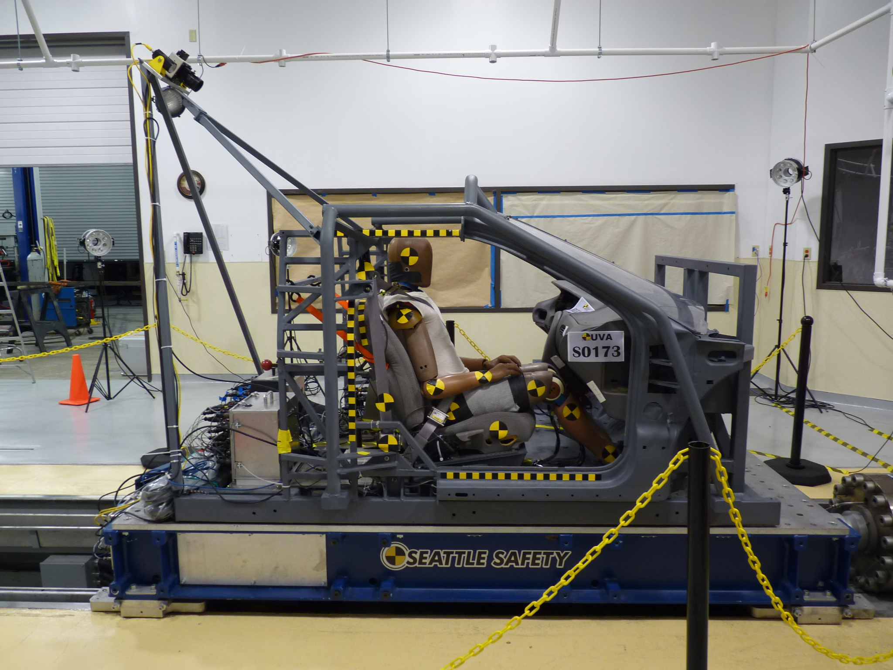

# Testning och kvalitetssäkring

---

## Enhetstester och testdriven utveckling (TDD)

Användning av enhetstester för att säkerställa korrekt funktionalitet och TDD för att skapa testbara och stabila lösningar. Enhetstester är särskilt värdefulla för tekniska, matematiska eller säkerhetskritiska funktioner, där precision och korrekthet är avgörande. I dessa fall kan enhetstester hjälpa till att verifiera komplexa logiska och beräkningsmässiga aspekter. För mindre kritiska delar kan det ofta räcka med tester på en högre nivå, såsom integrationstester, för att säkerställa att funktionerna samverkar som förväntat.

---

## Integrationstester

Testar interaktionen mellan olika systemkomponenter för att säkerställa att de fungerar tillsammans som förväntat. Integrationstester utförs ofta först i utvecklingsmiljö (dev), där systemets delar testas efter att enhetstester är genomförda.

---

## Systemtester

Systemtester görs på en högre nivå för att verifiera att hela systemet uppfyller kraven och fungerar som en enhet, där integrationen mellan alla delar testas i en realistisk miljö. Dessa tester säkerställer att alla funktioner och processer fungerar korrekt tillsammans innan systemet når slutanvändarna.

---

## Release management med dev, stage och prod

När systemet fungerar i utvecklingsmiljön (dev) flyttas det vidare till staging-miljö (stage) för en mer omfattande granskning och review, ofta med identisk binär för att säkerställa konsekvent beteende inför produktion. När produktägaren är nöjd kan release-ansvariga skicka ut uppdateringen till produktionsmiljö (prod).

---

## Board Bringup och hårdvarutestning

Ofta börjar utvecklingen med ett devkit för att snabbt komma igång med prototypning och utveckling av mjukvara. När funktionaliteten är validerad ritar man hårdvara för en mer specialiserad IoT-enhet. När de anpassade korten är klara beställs de, och bringup-processen startar. Detta inkluderar initial uppstart av hårdvaran, felsökning och verifiering av funktionalitet. Bringup-processen kan även kräva specifika tester, såsom radiotester för trådlös kommunikation, omfattande hårdvarutester, samt utveckling av mjukvara för att göra tester av komponenterna möjliga.

---

## Pre-compliance och certifieringstester

Förberedelser för certifieringar som CE-märkning genom att verifiera att produkten uppfyller alla nödvändiga krav. Dessa tester är ofta en naturlig förlängning av board bringup och hårdvarutestning. När hårdvaran är igång och bringup-processen är klar, följer pre-compliance tester för att säkerställa att systemet uppfyller regulatoriska krav, såsom EMC- och radiotester, vilket är nödvändigt innan certifieringsprocessen kan påbörjas.

---

## Produktionstester och kvalitetskontroll

Tester utförs under produktion för att säkerställa att varje enhet uppfyller kvalitetsstandarder innan leverans. Innan dessa tester genomförs, finns en **industrifas** som syftar till att säkerställa att produktionsprocessen fungerar som förväntat. Detta innebär att man säkerställer att alla produktionslinjer är korrekt kalibrerade och att produktionsutrustningen kan tillverka enheterna enligt specifikation. Fokus ligger på att säkerställa hög kvalitet i varje steg samt att möjliggöra säker provisionering av mjukvara, vilket innebär att rätt firmware och säkerhetscertifikat laddas upp på enheterna på ett säkert sätt.

---

## HIL (Hardware-in-the-Loop) tester

Simulerar och testar hårdvarukomponenter i en kontrollerad miljö för att verifiera funktionalitet under realistiska förhållanden. Under utvecklingsfasen används HIL-tester för att säkerställa att hårdvaran och mjukvaran fungerar tillsammans som avsett, innan systemet når fältet. Dessa tester är också viktiga vid firmware-uppdateringar för att verifiera att nya versioner inte orsakar problem för enheterna i fält, såsom att de blir oanvändbara (bricked) eller att nya säkerhetsluckor uppstår. Det är avgörande att enheterna fortsätter fungera pålitligt och att uppdateringar inte äventyrar säkerheten.

---
